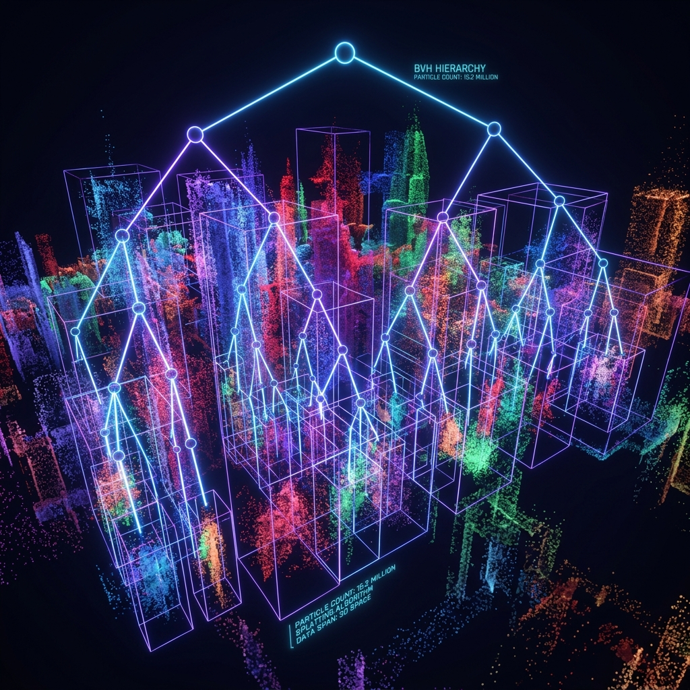

<div align="center">




# 🌳 splat-bvh-core

**Real-Time WebGPU Spatial Indexing for 3D Gaussian Splats**

[](https://github.com/nff747)
[](LICENSE)
[](https://www.typescriptlang.org/)
[]()

*Render 10 million Gaussians beautifully. Index them in milliseconds. Make them instantly interactive.*

[The Collision Problem](#the-problem-splats-are-ghosts) · [WGSL LBVH Architecture](#how-it-works-the-karras-lbvh-pipeline) · [Usage](#api-usage)

</div>

---

## The Problem: Splats are Ghosts

3D Gaussian Splatting provides photorealistic novel view synthesis, but under the hood, a splat scene is just a massive, unordered array of millions of floating ellipsoids. 
If you want to:
* Cast a ray from the mouse cursor to select a specific object in a 1GB `.ply` scan.
* Calculate physics collisions against a scanned environment.
* Culling invisible splats dynamically.

...doing so via brute force looping over 10,000,000 splats destroys the browser thread.

## The Solution

`splat-bvh-core` is a WebGPU compute engine that builds a **Linear Bounding Volume Hierarchy (LBVH)** directly on the GPU in milliseconds, turning a massive soup of pixels into a rapidly searchable spatial tree.

---

## How It Works: The Karras LBVH Pipeline

This library implements the highly parallel tree construction algorithm formulated by T. Karras (2012), written entirely in WGSL compute shaders.

### 1. Morton Encoding (Z-Curve)
A compute shader normalizes the 3D center of every splat and converts its `X`, `Y`, and `Z` coordinates into a single 30-bit **Morton Code** by interleaving their binary representations. This effectively maps 3D spatial locality into a 1D scalar value.

### 2. GPU Radix Sort
The splats are sorted based on their Morton codes. In memory, splats that are close together in the 3D world become physically adjacent in the GPU buffer.

### 3. Tree Construction
A final compute shader dispatches $N-1$ threads (one for each internal node of the BVH). By counting the leading zeros (CLZ) of the XOR'd Morton codes of adjacent splats, the shader dynamically discovers the common bit-prefixes. This topological data allows every thread to independently wire the `leftChild`, `rightChild`, and bounding box of its node without any locks or atomic bottlenecks.

---

## API Usage

### 1. Installation

```bash
npm install splat-bvh-core
```

### 2. Building the Hierarchy

```typescript
import { BVHBuilder } from 'splat-bvh-core';

// Assuming you have a WebGPU device and your splat centers loaded into a GPUBuffer
const numSplats = 5_000_000;
const builder = new BVHBuilder(device, { debug: true });

// Triggers the Morton -> Sort -> Build pipeline.
// Returns a GPUBuffer containing the structured binary tree.
const bvhTreeBuffer = await builder.buildHierarchy(
  splatCentersBuffer, 
  numSplats, 
  sceneBoundsBuffer
);
```

### 3. Interactive Raycasting

```typescript
import { SplatRaycaster } from 'splat-bvh-core';

const raycaster = new SplatRaycaster(device, bvhTreeBuffer);

// Convert mouse click to 3D ray
const hit = await raycaster.intersectRay({
  origin: Float32Array.from([0, 0, 0]),
  direction: Float32Array.from([0, 0, -1])
});

if (hit) {
  console.log(`Hit splat #${hit.splatIndex} at distance ${hit.distance}`);
}
```

---

## License

[MIT](LICENSE) — iKi / Frozen Flame

---

## 📜 Open Source & Commercial Use (MIT)

This project is 100% open-source software under the **[MIT License](LICENSE)**.

### 💼 Commercial Use & Free Redistribution
You are explicitly permitted to use, modify, fork, integrate, package, and sell commercial products or SaaS built using this engine with **one visible attribution requirement**:
> **Attribution Requirement**: You must include a visible credit to **nff747** in your application (e.g., `Powered by nff747` linking to [https://github.com/nff747](https://github.com/nff747) in your application UI, footer, about modal, or documentation).

```html
<!-- Example visible footer attribution -->
<p>Powered by <a href="https://github.com/nff747" target="_blank">nff747</a></p>
```
